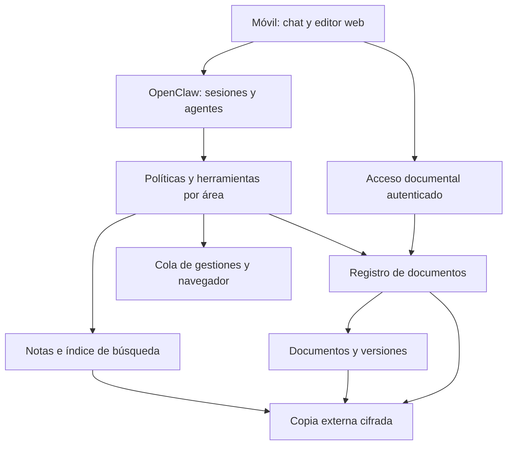

# 02 · Arquitectura y decisiones

Es un diseño objetivo. El código actual cubre routing, localización desde un manifiesto ficticio y registro persistente local de mensajes/expedientes. No integra aún los servicios del diagrama.

## Responsabilidades

- **OpenClaw:** canales, agentes, sesiones, invocación de modelos y herramientas. Mantener un adaptador pequeño y evitar un fork inicial.
- **Servicio documental propio:** autorización, identidad, versiones, movimientos, resolución de enlaces e historial. Esta capa resuelve el requisito que un simple directorio o acceso SFTP no garantiza.
- **Markdown:** conocimiento duradero, expedientes, decisiones, tareas y fuentes. Los originales no se sustituyen por resúmenes.
- **Índice:** derivado y reconstruible; SQLite con búsqueda textual para empezar. Separar índice recuperable de registro de identidad, que sí es dato autoritativo.
- **Editor:** probar SilverBullet en móvil y escritorio. Obsidian es alternativa si se resuelve explícitamente la sincronización móvil; una carpeta Drive en escritorio por sí sola no cierra ese requisito.
- **Gestor de archivos:** opcional. SFTPGo facilita acceso y administración de archivos; no asumir que aporta identidad estable de documentos. Nextcloud puede reducir desarrollo propio, a cambio de otra aplicación y su operación.

## Registro de decisiones

| ID | Decisión propuesta | Motivo y condición de revisión |
|---|---|---|
| D01 | Servidor canónico | Evita depender de Drive para el contexto; confirmar antes de migrar |
| D02 | Un UUID por documento lógico | No ligar identidad al path ni al hash; revisar si un proveedor con IDs satisface todo |
| D03 | Un bot con temas por área | Entrada móvil explícita sin llamada LLM para clasificar cada mensaje |
| D04 | Agentes separados y permisos reales | Separar memoria, skills y acceso; un workspace no basta |
| D05 | SQLite, proceso escritor único | Operación pequeña y portable; migrar si hay escritores distribuidos |
| D06 | Búsqueda textual antes de vectores | Menos infraestructura y coste; añadir embeddings tras evaluación |
| D07 | Editor web primero | Facilita acceso móvil sin exigir una carpeta local sincronizada |
| D08 | APIs de modelos | Requisito confirmado: no servir modelos locales |

## Almacenamiento: elección que debe cerrarse

| Opción | Papel | Condición |
|---|---|---|
| Directorios + servicio de identidad | Propuesta principal | Todas las mutaciones documentales pasan por el servicio |
| Nextcloud canónico | Alternativa | Ensayar IDs, versiones, borrados, restores y movimientos; evitar cambios directos al almacén interno |
| Drive canónico | Alternativa | Verificar continuidad de IDs según operación; servidor mantiene caché, no un segundo maestro |
| Drive como copia/exportación | Complemento | Versionado y restauración; sincronizar no equivale a hacer backup |
| SFTPGo | Acceso opcional | Empezar con documentos en lectura; escritura solo cuando sus eventos encajen en la identidad |

No instalar simultáneamente todos estos productos. B02 compara un recorrido completo antes de decidir.

## Qué significa filesystem

El sistema de archivos ofrece directorios, paths y permisos. Una herramienta filesystem o MCP expone operaciones al agente. SFTPGo ofrece protocolos e interfaz de acceso. Ninguno de esos conceptos garantiza por sí solo enlaces semánticos persistentes. El registro estable debe vivir en la aplicación o en un proveedor cuya semántica se haya validado.
